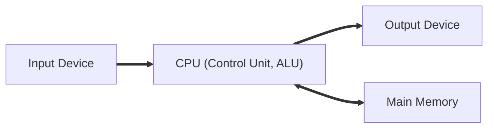

  
# Table of Contents
- [**Important Architectures**](#important-architectures)

  - [Von Neumann Architecture](#von-neumann-architecture)

  - [Single System Bus Architecture](#single-system-bus-architecture)

- [**Important Processes**](#important-processes)

  - [Fetch Decode Execute Interrupt Cycle  [FDEI]](#fetch-decode-execute-interrupt-cycle-fdei)

- [**Important Definitions**](#important-definitions)

- [**Questions to Consider**](#questions-to-consider)

  - [Fetch Decode Execute Interrupt Cycle](#fetch-decode-execute-interrupt-cycle)

    - [Describe the stages of FDEI Cycle](#describe-the-stages-of-fdei-cycle)

    - [What is an Interrupt](#what-is-an-interrupt)

    - [How are multiple Interrupts delt with](#how-are-multiple-interrupts-delt-with)

  - [Operating System](#operating-system)

    - [Describe the key management tasks of an operating system](#describe-the-key-management-tasks-of-an-operating-system)

# **Important Architectures**

  

## Von Neumann Architecture

## Single System Bus Architecture
  

  

# **Important Processes**

  

## Fetch Decode Execute Interrupt Cycle  [FDEI]

  

  

# **Important Definitions**

  

  

# **Questions to Consider**

  

  

## Fetch Decode Execute Interrupt Cycle

  

  

### Describe the stages of FDEI Cycle

  

  

### What is an Interrupt

  

  

### How are multiple Interrupts delt with

  

  

## Operating System

  

  

### Describe the key management tasks of an operating system
