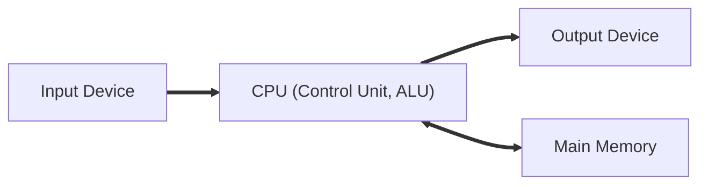

  
# Table of Contents
- [**Important Architectures**](#important-architectures)
  - [Von Neumann Architecture](#von-neumann-architecture)
  - [Single System Bus Architecture](#single-system-bus-architecture)
- [**Important Processes**](#important-processes)
  - [Fetch Decode Execute Cycle  [FDE]](#fetch-decode-execute-cycle-fde)
    - [An indepth Look at how FDE Cycle Works](#an-indepth-look-at-how-fde-cycle-works)
- [**Important Definitions**](#important-definitions)
- [**Questions to Consider**](#questions-to-consider)
  - [Fetch Decode Execute Interrupt Cycle](#fetch-decode-execute-interrupt-cycle)
    - [Describe the stages of FDEI Cycle](#describe-the-stages-of-fdei-cycle)
    - [What is an Interrupt](#what-is-an-interrupt)
    - [How are multiple Interrupts delt with](#how-are-multiple-interrupts-delt-with)
  - [Operating System](#operating-system)
    - [Describe the key management tasks of an operating system](#describe-the-key-management-tasks-of-an-operating-system)

# **Important Architectures**

  

## Von Neumann Architecture

## Single System Bus Architecture
  

  

# **Important Processes**

  

## Fetch Decode Execute Cycle  [FDE]

### An indepth Look at how FDE Cycle Works
Program is stored on main memory location addresses.

The following registers are used during the FDE Cycle.

`FETCH` Program Counter (PC), Merory Data Register (MDR), Memory Address Register (MAR), Current Instruction Register (CIR)

`DECODE` Control Unit (CU),

`EXECUTE` Accumulator (ACC), Arithmetic logic unit (ALU).

Main memory
|   ADDRESS	|   INSTRUCTION	|   
|---	|---	|
|  1 	|  LOAD 5 	|   	
|   2	|   ADD 6	|   	
|   	3|  STORE 7 	|
|   	4|   STOP	|
|   	5|   5 (Data item)	|
|   	6|   	3 (Data item)|
|   	7|   	|
|   	8|   	|

PC is first set to 1.  

That address is then stored in MAR; MAR is set to 1.  

Instruction at addr 1 is then loaded to MDR; MDR is set to "LOAD 5".  

The instruction is then copied over to CIR; CIR is set to "LOAD 5". 

PC is then incremented to the location of the next instruction; PC is set to 2.

Instruction at CIR is copied over to CU to begin execution. CU is set to "LOAD 5".

LOAD S is then executed by the CU. MAR is set to 5 (5 is loaded on to memory).

The data is then copied over to MDR; MDR is set to 5.

The data is then loaded into the ACC; ACC is set to 5.

LOAD 5 Instruction is now complete. Next instruction is then executed; MDR and MAR are set to 2
and ADD 6 respectively to reflect what is on the PC.

CIR is then set to "ADD 6".

PC is incremented to next instruction. PC is set to 3.

CIR is copied to CU; CU is set to ADD 6.

MAR is set to access memory address at location 6.

MDR is set to 3 (reflected at mem addr 6).

Since it's an ADD instruction, MDR and AC are passed onto the ALU where the result, 8 is stored.

The cycle repeats until everything is done.
  

  

# **Important Definitions**

  

  

# **Questions to Consider**

  

  

## Fetch Decode Execute Interrupt Cycle

  

  

### Describe the stages of FDEI Cycle

The CPU fetches an instruction from memory and keeps track of the current instruction it is on using
the internal program counter (Instruction pointer) register, which is incremented as each instruction
is executed.

The instruction is then interpreted to prepare the internal circuitry of the CPU for execution and
ensure all the operands are loaded into the CPU's registers.

The CPU then executes the instruction and saves the result by updating the CPU's registers or
performing data transfer tasks as needed.

While CPU is idling and waiting for an instruction to be executed, the program handles the control
back to CPU which can resume execution of other instructions. CPU then acknowledges the interrupt
and stores the Program Counter and Program Status Word registers (of the program that sent the
interrupt) in memory.

CPU then loads an address of the interrupt handler to PC and starts the execute the interrupt
handler. The interrupted program is now considered suspended. The handler then saves the current
state of the remaining CPU registers of the interrupted program. Restores the state of the remaining
CPU registers and then restores the PC and PWS registers this resuming the execution of the
interrupted program.

### What is an Interrupt
An interrupt is a signal sent from a device or a software to the operating system. It causes the OS to
temporarily stop what it is doing and service the interrupt using its interrupt handler.

  

  

### How are multiple Interrupts delt with

  

  

## Operating System

  

  

### Describe the key management tasks of an operating system

The tasks of Operating System include
 
`Memory Management` that controls the movement of data between RAM, Processor etc. IT also
allocated memory to processes.

`File Management` which creates files and folders and performs basic CRUD operations on them.

`Security Management` Which creates accounts, password, upgrades to firewall, anti-malware, and
protects programs and users from accessing the kernel.

`Hardware Management` Which receives and sends 1/0 to devices.

`Process Management` Decided which process to run via scheduling which instructions to run in which order.
